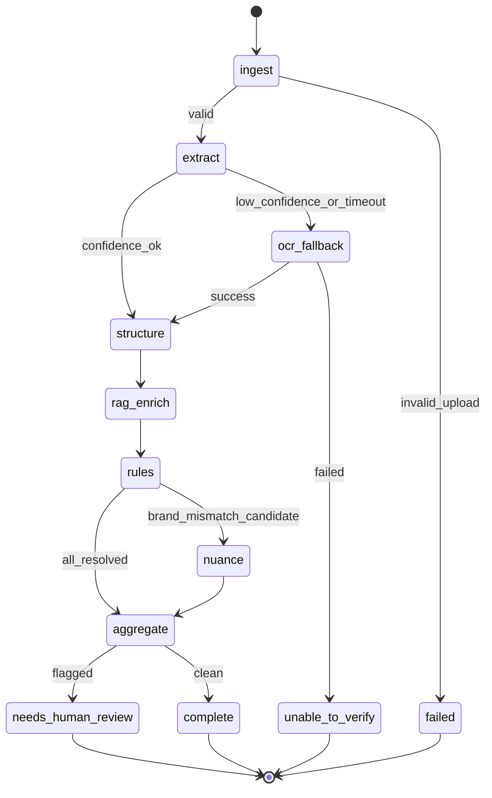

# ARCHITECTURE.md — LabelForge Agent Software Factory

| Primary Source | [ClientRequirement.md](ClientRequirement.md) |
| Derived Spec | [PRD.md](PRD.md) |
| Deliverables | [DELIVERABLES.md](DELIVERABLES.md) |
| File Header Standard | [CODE_COMMENT_HEADER_TEMPLATE.md](CODE_COMMENT_HEADER_TEMPLATE.md) |
| Template | [ARCHITECTURE_TEMPLATE_MOM_MILE.md](ARCHITECTURE_TEMPLATE_MOM_MILE.md) |

> **Engineers & architects:** [ONBOARDING.md](ONBOARDING.md) · **Code reviewers:** [README.md](README.md) → [REVIEWER_GUIDE.md](REVIEWER_GUIDE.md) → [DELIVERABLES_PROOF.md](DELIVERABLES_PROOF.md) → this doc §1–2 for factory pattern. Live demo: [labelforge-w32d.onrender.com](https://labelforge-w32d.onrender.com).

---

## Reading guide

| Audience | Read | Time |
|----------|------|------|
| **Engineers & architects** | [ONBOARDING.md](ONBOARDING.md) | ~30 min |
| **Client reviewers** | Skip this doc — use [REVIEWER_GUIDE.md](REVIEWER_GUIDE.md) + [DELIVERABLES_PROOF.md](DELIVERABLES_PROOF.md) | 3 min |
| **Interview reviewers** | §1 Executive Summary, §3A Client Mandatory, §6 Graph orchestration | ~15 min |
| **Deep dive** | Full factory, RAG, evals, HITL stubs | ~45 min |

---

## Document Hierarchy & Ship Order

| Layer | Document | Governs |
|-------|----------|---------|
| **Client truth** | [ClientRequirement.md](ClientRequirement.md) | Requirements + **repo + URL only** |
| **Proof** | [DELIVERABLES_PROOF.md](DELIVERABLES_PROOF.md) | File paths + live URLs |
| **Submission** | [DELIVERABLES.md](DELIVERABLES.md), PRD §10 | What to submit and prove |
| **Target state (this doc)** | ARCHITECTURE.md | Factory / graph / RAG / evals — **implemented in `app/`** |
| **Ship order** | PRD §12 | **P1 first** → P2 factory depth → P3 eval CI |

**Cardinal rule:** Implement **P1** as a working verification pipeline; grow toward this architecture without blocking submission.

---

# ============================================================================
# PROJECT ARCHITECTURE
# ============================================================================
# Project Name: LabelForge — TTB Alcohol Label Verification Agent Factory
# Repository: github.com/monigarr/instructions (application in app/)
# Version: 0.1.0
# Status: P1 shipped; P2+ factory/graph/RAG/evals in `app/` — **live** at [labelforge-w32d.onrender.com](https://labelforge-w32d.onrender.com)
# Classification: Internal
# Author: Monica Peters (MoniGarr)
# Organization: MoniGarr.com LLC | Gauntlet AI GFA Cohort 5 Fellowship, 2026
# Architecture Method: M.O.M. + M.I.L.E. + Gauntlet AI-Native Factory Pattern
# Primary Maintainers: MoniGarr
# Created: 2026-06-09
# Last Updated: 2026-07-08 (aligned with `app/` — 30 golden evals, 34 catalog + 300 scale fixtures, 28 pytest tests, CI regression gate)
# License: TBD
# ============================================================================
#
# DESCRIPTION
# ----------------------------------------------------------------------------
# Phased architecture for TTB label verification:
#   P1 (client submission): upload → extract → rules → simple UI + batch
#   P2+ (target state): LabelForge Agent Software Factory
#     - S.O.L.I.D. modular boundaries (ports/adapters)
#     - LangGraph orchestration, RAG, specialized agents, eval harness
# ClientRequirement.md remains the sole normative deliverable source.
#
# ============================================================================

---

# 1. Executive Summary

## 1.1 Overview

**LabelForge** satisfies [ClientRequirement.md](ClientRequirement.md) as a standalone TTB prototype: **≤ ~5 s** per label, **200–300** batch throughput, **grandmother-simple UI**, zero COLA coupling.

| Phase | Goal | Submission Status |
|-------|------|-------------------|
| **P1** | Runnable repo + deployed URL — upload → OCR/extract → deterministic rules → field-level results (single + batch) | **Shipped** in [`app/`](app/) — see [DELIVERABLES_PROOF.md](DELIVERABLES_PROOF.md) |
| **P2+** | Target-state **Autonomous Agent Software Factory** — LangGraph, RAG, specialized agents, eval harness, S.O.L.I.D. | **Implemented** in `app/src/factory/`, `graph/`, `agents/`, `rag/`, `evals/`; toggle via `USE_FACTORY_GRAPH` |

The factory pattern is **phased evolution**, not scope creep. P1 meets the client; P2+ meets the interview architecture story without violating "working core over ambitious incomplete features."

## 1.2 Business Objective

| Dimension | Definition |
|-----------|------------|
| **Primary problem** | 47 agents drowning in repetitive form-to-label matching across ~150K applications/year |
| **Prototype ROI** | 5–10× faster routine checks; eval-measurable accuracy; procurement evidence vs. failed 30–40 s OCR pilot |
| **Interview ROI** | Demonstrate agent factory, graph control flow, RAG grounding, eval discipline, SOLID extensibility |
| **Long-term intent** | Azure-hosted, FedRAMP-aware institutional service (X4); COLA adjacency (X3) |

## 1.3 Operational Philosophy

| Pillar | Implementation |
|--------|----------------|
| **AI-First Engineering** | Agents + graph + RAG accelerate extraction and reasoning |
| **AI-Native Architecture** | Factory composes agents; graph owns control flow; evals own quality |
| **Gauntlet Factory Pattern** | Build → orchestrate → retrieve → verify → evaluate → ship |
| **Human-in-the-Loop** | Compliance agents retain legal authority; graph supports HITL checkpoints |
| **S.O.L.I.D.** | Domain depends on interfaces; adapters swap OCR/vector/LLM providers without orchestrator changes |
| **Echelon / M.O.M. / M.I.L.E.** | Documentation, headers, traceability, handoff-ready from day one |

---

# 2. MoniGarr Operating Model (M.O.M.)

## 2.1 Human Accountability First

The **RulesEngineAgent** emits verdict guidance; the **human compliance agent** decides. No graph terminal node performs auto-approval. RAG and LLM outputs are **untrusted** until validated by deterministic rules.

## 2.2 Ancient + Human + Artificial Intelligence Integration

| Layer | Factory Component |
|-------|-------------------|
| **Ancient (Traditional)** | TTB checklists, canonical warning text in RAG corpus |
| **Human** | UI review, HITL graph checkpoint, batch export to COLA (external) |
| **Artificial** | VisionExtractionAgent, ComplianceRAGAgent, NuanceAgent, BatchSupervisorAgent |

## 2.3 Enterprise from Day One

Even P1 enforces: clear module boundaries, secrets via env, README trade-offs, test labels in repo.

P2+ adds: trace IDs, interface contracts, eval CI regression gate, modular layout (`factory/`, `graph/`, `rag/`, `rules/`, `evals/`).

## 2.4 Documentation as Infrastructure

PRD + ARCHITECTURE + DELIVERABLES + eval README = operational infrastructure for evaluators and architecture defense.

## 2.5 Handoff-Ready Engineering

A new engineer must be able to: run eval suite → read graph diagram → swap `IOCRProvider` adapter → add `IFieldRule` without touching orchestrator.

---

# 3. System Scope

## 3A. Client Mandatory (P1 — ClientRequirement.md)

| Requirement | P1 Implementation | Stakeholder Source |
|-------------|-------------------|-------------------|
| Single-label verification | Upload + application data → field verdicts | Sarah Chen |
| Batch 200–300 | Batch upload + progress + summary | Sarah Chen / Janet (Seattle) |
| TTB fields + spirits example | Deterministic `IFieldRule` or equivalent | ClientRequirement.md § Sample Label |
| Government warning exactness | Strict rule (caps, bold heuristic); document limits | Jenny Park |
| Brand fuzzy nuance | Normalized compare or flag for human review | Dave Morrison |
| ≤ ~5 s per label | Performance budget on P1 path | Sarah Chen |
| Simple UI | No factory jargon in default agent view | Sarah Chen |
| Standalone, no COLA | No COLA runtime dependency | Marcus Williams |
| Two deliverables | Repo + URL only ([DELIVERABLES.md](DELIVERABLES.md)) | ClientRequirement.md |

## 3B. Phased Target State (P2+ — This Document)

| Capability | Phase | Notes |
|------------|-------|-------|
| Agent Software Factory | P2 | Composition root, DI, agent registry |
| LangGraph orchestration | P2 | Conditional routing, OCR fallback nodes |
| RAG (TTB corpus) | P2 | Grounding; rules still own verdicts |
| NuanceAgent | P2 | Brand equivalence suggestions |
| Eval harness + CI gates | P3 | **Enforced in CI** for regression; does not block production URL at runtime |
| SOLID port/adapters | P1→P2 | Start interfaces in P1 even if monolith layout |
| HITL graph checkpoints | P4 | Stretch |

## 3C. Out of Scope (Client + Architecture)

| Item | Rationale |
|------|-----------|
| COLA integration | Marcus Williams: "years away, realistically" |
| FedRAMP production | Prototype only; document production gaps |
| PII retention | Synthetic labels only |
| Autonomous legal approval | Human agent retains authority per M.O.M. |
| Full multi-beverage rule matrix | Extensible via `IFieldRule` packs; spirits baseline for P1 |

## 3D. Implementation Phases (Aligned with PRD §12)

| Phase | Pipeline | Submission |
|-------|----------|------------|
| **P1 — MVP** | `upload → validate → extract → structure → rules → results` | **Submit repo + URL** when §3A complete |
| **P2 — Factory** | + factory, LangGraph, RAG, NuanceAgent | Interview craft in code + README |
| **P3 — Evals** | + golden/adversarial suites, CI block on merge | Quality discipline; not client submission gate |
| **P4 — Stretch** | + HITL, explanations, glare handling | Document if cut |

```text
P1 CRITICAL PATH (client):
  UI → API → extract (IOCRProvider) → rules → FieldVerdict[] → UI

P2+ TARGET (factory):
  UI → API → LabelForgeFactory → LangGraph → [agents] → FieldVerdict[] → UI
```

---

# 4. STRATA-X Scale Classification

## Current: X3 — Cross-System Architecture (Bounded Prototype)

**Upgrade from X2 rationale:** The **Agent Software Factory** introduces cross-cutting orchestration across agents, graph state, RAG retrieval, eval runners, and UI/API boundaries—multiple cohesive subsystems with explicit contracts, characteristic of X3 within a single deployable unit.

**Bounded scope:** Single tenant, no COLA federation, no institutional IAM—prototype remains time-boxed.

| Trigger | Next Level |
|---------|------------|
| COLA API bridge + agency SSO | X3 institutional boundary |
| FedRAMP multi-tenant production | X4 |
| Generational sovereign compliance platform | X5 |

---

# 5. Architecture Goals

## 5.1 Functional Goals

### P1 (Client)

1. End-to-end label verification on repo + deployed URL
2. Batch processing with progress for 200–300 labels
3. Simple UI: application vs. extracted vs. verdict per field
4. README documents approach, limits, and performance observations

### P2+ (Target State)

5. Factory composes agents and compiles verification graph
6. RAG enriches compliance context; rules own verdict bits
7. Eval harness measures regression (P3)

## 5.2 Non-Functional Goals

| NFR | P1 (Client) | P2+ (Target) |
|-----|-------------|--------------|
| **Performance** | ≤ ~5 s user-perceived | P95 node budgets in graph |
| **UX** | Grandmother-simple UI | Factory complexity hidden in backend/logs |
| **Eval accuracy** | Manual + fixture demos OK | ≥ 95% golden set (P3) |
| **Observability** | README + basic logs | `trace_id`, spans, optional LangSmith |
| **Network resilience** | Document or implement OCR fallback | Graph `ocr_fallback` node |
| **Security** | No secrets in repo; upload validation | Full secret injection, prompt sanitization |

---

# 6. LabelForge Agent Software Factory (P2+ Target State)

> Sections 6–8 describe **where P1 evolves** — not what ClientRequirement.md mandates for submission.

## 6.1 Factory Pattern (Gauntlet AI-Native)

The **LabelForge Factory** is the autonomous composition root:

```text
┌─────────────────────────────────────────────────────────────────────────┐
│                    LABELFORGE AGENT SOFTWARE FACTORY                     │
│  ┌─────────────┐  ┌──────────────┐  ┌─────────────┐  ┌──────────────┐ │
│  │ Agent       │  │ Dependency   │  │ Graph       │  │ Eval Policy  │ │
│  │ Registry    │  │ Injection    │  │ Compiler    │  │ Enforcer     │ │
│  └─────────────┘  └──────────────┘  └─────────────┘  └──────────────┘ │
│         │                  │                  │                 │       │
│         └──────────────────┴──────────────────┴─────────────────┘       │
│                                    │                                     │
│                    creates VerificationGraphRunner                       │
└────────────────────────────────────┬────────────────────────────────────┘
                                     │
         ┌───────────────────────────┼───────────────────────────┐
         ▼                           ▼                           ▼
   [ Single run ]              [ Batch runs ]              [ Eval runs ]
   POST /verify                POST /batch/verify          evals/runner
```

**Factory Responsibilities:**

| Function | Description |
|----------|-------------|
| **Register agents** | Map role → `IAgentNode` implementation + version |
| **Wire adapters** | Inject `IOCRProvider`, `IRAGRetriever`, `IRulesEngine`, loggers |
| **Compile graph** | Build LangGraph from `graph/verification_graph.py` + config |
| **Execute runs** | Assign `run_id` / `trace_id`; stream state updates |
| **Enforce policy** | No auto-approve; eval regression thresholds in CI (P3) |
| **Scale batch** | Concurrency pool with backpressure |

## 6.2 Specialized Agent Roster

| Agent | SRP (Single Responsibility) | Input → Output |
|-------|----------------------------|----------------|
| **IngestionAgent** | Validate/normalize uploads | bytes → `NormalizedImage` |
| **VisionExtractionAgent** | OCR/vision via adapter | image → `OCRResult` |
| **FieldStructuringAgent** | OCR blocks → domain record | `OCRResult` → `ExtractedLabelRecord` |
| **ComplianceRAGAgent** | Retrieve TTB context | field keys → `RAGContext[]` |
| **RulesEngineAgent** | Deterministic verdict bits | extracted + application + RAG → `FieldVerdict[]` |
| **NuanceAgent** | Brand fuzzy equivalence | brand pair → `NuanceSuggestion` |
| **BatchSupervisorAgent** | Fan-out/fan-in batch jobs | manifest → `BatchResult` (implemented as [`BatchVerificationService`](app/src/verify/batch_service.py) / `IBatchSupervisor`) |
| **EvalRunnerAgent** | Offline quality gates | dataset → `EvalReport` |

**Autonomy boundary:** Agents are **autonomous within their node** but **orchestrated by the graph**—no agent directly invokes another; the factory/graph controls all transitions (Gauntlet best practice).

## 6.3 LangGraph Orchestration (P2+)

### P1 MVP Pipeline (Client Submission — May Be Linear Code, Not LangGraph)

```text
ingest → extract → structure → rules → aggregate → response
         ↓ (fail)
      ocr_fallback (local) → structure → rules → …
```

### P2+ Target Graph

#### State Schema (`VerificationState`)

```python
class VerificationState(TypedDict):
    run_id: str
    trace_id: str
    label_id: str
    image_ref: bytes | str
    application: ApplicationRecord
    ocr_result: OCRResult | None
    extracted: ExtractedLabelRecord | None
    rag_context: list[RAGChunk]
    verdicts: list[FieldVerdict]
    nuance: NuanceSuggestion | None
    status: Literal["running", "needs_human_review", "complete", "failed"]
    errors: list[str]
    timings_ms: dict[str, float]
    route: str  # last routing decision for observability
```

#### Graph Topology



#### Conditional Routing Rules

| Condition | Route |
|-----------|-------|
| OCR confidence < threshold | `ocr_fallback` (local Tesseract) |
| Cloud OCR timeout | retry once → `ocr_fallback` |
| Strict field rule fail on warning | `needs_human_review` (never silent pass) |
| Brand normalized mismatch | `nuance` → suggest equivalence |
| All fields match | `complete` |

#### Performance Budget

**P1 (client path):** total user-perceived **≤ ~5 s** (extract dominates).

**P2+ graph node budgets (when LangGraph adopted):**

| Node | P95 Budget |
|------|------------|
| ingest | 300 ms |
| extract | 2,500 ms |
| ocr_fallback | +1,500 ms (exception path) |
| structure | 500 ms |
| rag_enrich | 500 ms (P2+ only; skip in P1) |
| rules + nuance | 700 ms |
| aggregate | 200 ms |
| **Total critical path** | **≤ 5,000 ms** |

## 6.4 RAG Architecture (P2+)

```text
┌──────────────────────────────────────────────────────────────────┐
│                        RAG SUBSYSTEM                              │
│  ┌─────────────┐    ┌──────────────┐    ┌─────────────────────┐ │
│  │ TTB Corpus  │───▶│ Chunker +    │───▶│ Vector Store        │ │
│  │ (markdown/  │    │ Metadata     │    │ Chroma / pgvector / │ │
│  │  json)      │    │ field,type   │    │ Azure AI Search     │ │
│  └─────────────┘    └──────────────┘    └──────────┬──────────┘ │
│                                                     │            │
│  ComplianceRAGAgent ◀──── IRAGRetriever.retrieve ──┘            │
│         │                                                        │
│         ▼                                                        │
│  RAGContext[] attached to VerificationState                      │
│  (chunk_id, field, excerpt, score)                             │
└──────────────────────────────────────────────────────────────────┘
```

**Corpus Sources (Public / Internal Fixtures):**

- Canonical TTB government warning text (exact wording)
- Field definitions (brand, class/type, ABV, net contents)
- Distilled spirits requirements baseline
- Common rejection patterns (title-case warning, small font)

**Grounding Contract:**

| Allowed | Forbidden |
|---------|-----------|
| RAG supplies regulatory context to rules + optional LLM explanation | LLM alone issuing pass/fail without RulesEngineAgent |
| Cite `chunk_id` in logs and optional README/debug panel | Free-form hallucinated regulatory citations |
| Retrieve per-field top-k | Whole-corpus dump into prompt |

**Firewall Path:** `LocalEmbeddingRetriever` + on-disk Chroma—zero outbound calls.

## 6.5 Eval Architecture (P3 — Engineering, Not Client Deliverable)

```text
┌──────────────────────────────────────────────────────────────────┐
│                     EVAL HARNESS (EvalRunnerAgent)               │
│  datasets/          metrics/           runners/                  │
│  golden_labels ──▶  field_accuracy ──▶ run_eval_suite.py        │
│  adversarial     warning_recall       │  per-field breakdowns    │
│  rag_queries     rag_precision        ▼                          │
│                  latency_p95     CI Gate (GitHub Actions)       │
│                                  - block on regression           │
│                                  - upload EvalReport artifact    │
└──────────────────────────────────────────────────────────────────┘
```

| Eval Type | Phase | CI Policy |
|-----------|-------|-----------|
| **Unit (rules + metrics + batch + scale)** | P1 recommended | **28** pytest tests in CI; block on failure |
| **Graph E2E**    | P2+            | Warn then block in P3 |
| **Adversarial**  | P3             | Block merge when adopted |
| **Performance**  | P1             | Document in README; warn in CI |

**P1 minimum:** fixture labels + manual or script verification of warning rule. **Do not delay deployed URL** waiting for full eval CI.

**Optional:** LangSmith traces for graph runs during development; export `trace_id` correlation.

## 6.6 High-Level System Diagram

### P1 (Client Submission)

```text
┌─────────────────────────────────────────────────────────────────────────┐
│              COMPLIANCE AGENT UI — Simple, Obvious                       │
│         Upload │ Batch │ Results │ Application vs. Label Diffs           │
└───────────────────────────────┬─────────────────────────────────────────┘
                                │ REST
                                ▼
┌─────────────────────────────────────────────────────────────────────────┐
│                   API + VERIFICATION SERVICE (P1)                        │
│         validate → IOCRProvider → rules (IFieldRule[]) → verdicts        │
└─────────────────────────────────────────────────────────────────────────┘
```

### P2+ Target (LabelForge Factory)

```text
┌─────────────────────────────────────────────────────────────────────────┐
│                   COMPLIANCE AGENT UI (React + TypeScript)               │
│         Upload │ Batch Manifest │ Results │ Field Diffs                    │
└───────────────────────────────┬─────────────────────────────────────────┘
                                │ REST / SSE (batch progress)
                                ▼
┌─────────────────────────────────────────────────────────────────────────┐
│                   API LAYER (FastAPI)                                    │
│         /verify │ /batch/verify │ /health │ /runs/{id}                   │
└───────────────────────────────┬─────────────────────────────────────────┘
                                │
                                ▼
┌─────────────────────────────────────────────────────────────────────────┐
│              LABELFORGE AGENT SOFTWARE FACTORY                           │
│   compile_graph() │ create_run() │ BatchSupervisorAgent                  │
└───────────────────────────────┬─────────────────────────────────────────┘
                                │
                                ▼
┌─────────────────────────────────────────────────────────────────────────┐
│              LANGGRAPH — VerificationGraphRunner                           │
│  ingest → extract → structure → rag_enrich → rules → nuance → aggregate  │
└───┬─────────────┬─────────────────┬──────────────────┬──────────────────┘
    │             │                 │                  │
    ▼             ▼                 ▼                  ▼
 IOCRProvider  IRAGRetriever   IRulesEngine      IEvalRunner (CI)
 Azure/Tess    Chroma/Azure    IFieldRule[]      golden/adversarial
```

---

# 7. S.O.L.I.D. Architecture Map

## 7.1 Layer Diagram

```text
┌─────────────────────────────────────────────────────────────┐
│  PRESENTATION (UI) — depends on API DTOs only               │
├─────────────────────────────────────────────────────────────┤
│  APPLICATION (API, BatchSupervisor) — depends on ↓            │
├─────────────────────────────────────────────────────────────┤
│  DOMAIN — VerificationState, ApplicationRecord, FieldVerdict│
│           IAgentNode, IRulesEngine, IFieldRule interfaces   │
├─────────────────────────────────────────────────────────────┤
│  ORCHESTRATION — Factory, Graph compiler, Graph runner      │
├─────────────────────────────────────────────────────────────┤
│  INFRASTRUCTURE (ADAPTERS) — OCR, RAG, LLM, logging, CI     │
└─────────────────────────────────────────────────────────────┘
         ▲ DIP: domain/orchestration depend on interfaces only
```

## 7.2 Interface Catalog (Interface Segregation + DIP)

| Interface | Implementations | Responsibility |
|-----------|-----------------|----------------|
| `IOCRProvider` | `AzureDocIntelProvider`, `TesseractProvider` | Vision extraction |
| `IRAGRetriever` | `ChromaRetriever`, `AzureSearchRetriever` | Top-k regulatory context |
| `IEmbeddingProvider` | `OpenAIEmbeddings`, `LocalEmbeddings` | Vector indexing |
| `IFieldRule` | `BrandFuzzyRule`, `WarningExactRule`, `ABVPatternRule`, … | Single field verdict |
| `IRulesEngine` | `DeterministicRulesEngine` | Composes `IFieldRule[]` |
| `IAgentNode` | Each agent class | One graph node execution |
| `IGraphRunner` | `LangGraphRunner` | Stateful orchestration |
| `IFactory` | `LabelForgeFactory` | Composition root |
| `IEvalRunner` | `OfflineEvalRunner` | Quality gates |

## 7.3 SOLID by Example

| Principle | LabelForge Example |
|-----------|-------------------|
| **S** — Single Responsibility | `WarningExactRule` validates only government warning—nothing else |
| **O** — Open/Closed | Add `WineABVExceptionRule` by registering new `IFieldRule`—no orchestrator edit |
| **L** — Liskov Substitution | Swap OCR providers without changing `VisionExtractionAgent` |
| **I** — Interface Segregation | Agents depend on `IOCRProvider`, not full cloud SDK surface |
| **D** — Dependency Inversion | `LabelForgeFactory` reads config → wires interfaces → agents never `new` adapters |

## 7.4 Repository Layout

### P1 Minimum (Client Submission)

```text
app/
├── README.md              # setup, run, approach, trade-offs, demo URL
├── src/                   # any structure; verification + UI + API
├── fixtures/              # sample labels + application JSON
├── .env.example
└── (optional) tests/      # rules unit tests recommended
```

### P2+ Target Layout (Factory Evolution — Implemented in `app/`)

```text
app/
├── README.md
├── pyproject.toml / package.json
├── .env.example
├── src/
│   ├── factory/           # LabelForgeFactory, DI container
│   ├── agents/            # IAgentNode implementations
│   ├── graph/             # LangGraph definition, VerificationState
│   ├── rag/               # corpus/, indexer, retrievers
│   ├── rules/             # IFieldRule implementations
│   ├── adapters/          # OCR, embeddings, vector store
│   ├── api/               # FastAPI routes
│   └── domain/            # Records, enums, interfaces
├── ui/                    # React app
├── evals/
│   ├── datasets/
│   ├── metrics/
│   └── runners/
├── fixtures/              # Catalog + scale labels + JSON manifests
├── scripts/               # generate_fixtures, generate_scale_fixtures, load tests
└── tests/                 # Pytest unit tests

.github/workflows/         # CI at repo root (pytest, eval suite, UI build)
render.yaml                # Render Blueprint
```

---

# 8. AI-Native Engineering Model (Gauntlet Alignment)

## 8.1 Gauntlet Factory Loop

```text
Plan (PRD) → Architect (this doc) → Build agents → Wire graph →
Index RAG → Write evals → Run CI gates → Deploy → Observe traces → Iterate
```

| Gauntlet Concept | LabelForge Implementation |
|------------------|---------------------------|
| **Agents** | 8 specialized agents via `IAgentNode` |
| **Graphs** | LangGraph `VerificationState` with conditional edges |
| **RAG** | TTB corpus + ComplianceRAGAgent at enrich node |
| **Evals** | Golden + adversarial datasets; CI blocks regression |
| **SOLID** | Interface catalog; factory composition root |
| **Ship MVP** | **P1:** linear or light graph; rules own verdicts; URL live |

## 8.2 Human-in-the-Loop Controls

| Control | Mechanism |
|---------|-----------|
| Legal authority | Human agent; system emits guidance only |
| HITL checkpoint | Graph `needs_human_review` terminal |
| Low confidence | Route to `unable_to_verify`, never auto-pass |
| Eval gate | Optional P3 CI on merge — **not** a blocker for demo URL |
| Override | Agent proceeds in COLA externally; UI documents limits |

---

# 9. Agent Council Review (ACR)

| Agent | Factory Responsibility |
|-------|------------------------|
| Architect Agent | SOLID boundaries, graph routing correctness |
| Security Agent | Upload validation, prompt injection on RAG queries |
| Audit Agent | TTB field + warning coverage vs. ClientRequirement.md |
| Verification Agent | Golden eval suite authorship |
| Documentation Agent | README, ARCHITECTURE, headers |
| Adversarial Agent | False-pass fixtures, wrong warning casing |
| Performance Agent | 5 s graph budget profiling per node |
| **Eval Agent** | Regression thresholds, metric definitions |

**Governance:** No autonomous deploy; no self-modifying rules; eval Agent gates merge.

---

# 10. Security Architecture

| Control | Factory Note |
|---------|--------------|
| Upload safety | IngestionAgent validates MIME, size, decode |
| Prompt injection | Sanitize RAG queries; no user text in system prompts unchecked |
| Secret management | Factory reads env; adapters never log keys |
| Data isolation | Ephemeral `VerificationState`; no cross-run leakage |
| Supply chain | Lockfiles + Dependabot + eval on dependency bump |

---

# 11. Privacy & Data Governance

- **Prototype:** synthetic labels; public TTB text in RAG corpus; no applicant PII.
- **Production path:** Azure Key Vault, retention policies, PIA—documented as X4 requirement.

---

# 12. Observability Architecture

| Signal | Source |
|--------|--------|
| `trace_id` | Factory at run creation |
| Node spans | LangGraph callbacks / OpenTelemetry |
| RAG citations | `chunk_id` per retrieval |
| Eval scores | CI artifact + optional dashboard |
| LangSmith | Dev/staging optional |

**Observability (P1):** basic request logging sufficient.

**P2+:** `trace_id`, node spans, RAG citations in **logs** — not required in default compliance-agent UI (Sarah Chen UX).

---

# 13. Verification & Evaluation

**Rules engine owns verdicts; evals own release quality.**

### 13.1 Field Rule Summary

| Field | Rule Class | Type |
|-------|------------|------|
| Brand | `BrandFuzzyRule` | Normalized fuzzy + NuanceAgent flag |
| Class/type | `ClassTypeRule` | Normalized exact |
| ABV | `ABVPatternRule` | Regex pattern |
| Net contents | `NetContentsRule` | Unit normalization |
| Government warning | `WarningExactRule` | Strict + bold heuristic |
| Bottler address | `AddressContainsRule` | Fuzzy contains |
| Country of origin | `CountryExactRule` | Exact |

---

# 14. Repository Governance

## 14.1 Instructions Repo (This Repo)

ClientRequirement.md · DELIVERABLES.md · PRD.md · ARCHITECTURE.md · templates

## 14.2 Application Repo

### Client Required (P1 — Submit When Complete)

| Item | Required by Client |
|------|-------------------|
| README.md | ✓ setup, run, **approach, tools, assumptions, trade-offs** |
| All source code | ✓ end-to-end verification |
| fixtures / test labels | ✓ encouraged by client |
| Deployed HTTPS URL | ✓ working prototype |

### P2+ Target (Interview Craft — Not Submission Blockers)

| Path | Phase | Purpose |
|------|-------|---------|
| `src/factory/` | P2 | Agent software factory |
| `src/graph/` | P2 | LangGraph orchestration |
| `src/agents/` | P2 | Specialized agents |
| `src/rag/` | P2 | TTB corpus retrieval |
| `src/rules/` | P1+ | SOLID field rules (can live in `src/` without factory folder) |
| `evals/` | P3 | Datasets + CI runner |

Echelon recommended (any phase): SECURITY.md, VERIFY.md, CHANGELOG.md, CONTRIBUTING.md

---

# 15. Echelon Engineering File Standards

Every production file uses [CODE_COMMENT_HEADER_TEMPLATE.md](CODE_COMMENT_HEADER_TEMPLATE.md) with PURPOSE, SECURITY, PERFORMANCE, OPERATIONAL sections.

### Example: Graph Node Agent Header

```python
"""
===============================================================================
FILE: rules_engine_agent.py
AUTHOR: MoniGarr (Monica Peters)
CREATED: 2026-06-09
CLASSIFICATION: Internal

PURPOSE:
IAgentNode implementation — runs IRulesEngine against extracted + application data.
Owns deterministic verdict bits (Gauntlet: rules over LLM for pass/fail).

DEPENDENCIES:
  - domain.interfaces.IRulesEngine, IAgentNode
  - graph.verification_state.VerificationState

SECURITY:
  - No logging of full label/application text in production mode

PERFORMANCE:
  - Target ≤ 700ms; pure CPU, no network

OPERATIONAL:
  - Feature flag: STRICT_WARNING=true (never disable in prod path)
===============================================================================
"""
```

---

# 16. Deployment Architecture

```text
GitHub → Actions(pytest, eval suite, UI build) → PaaS/Azure → HTTPS URL
                              │
                              └─ eval_suite fails build on regression (production URL ships independently)
```

| Environment | Behavior |
|-------------|----------|
| Local | P1 path; local OCR fallback if configured |
| **Demo URL (client deliverable)** | P1 §3A — factory/RAG off by default |
| CI | pytest + eval regression gate + UI build; latency benchmark non-blocking |

---

# 17. Scalability Strategy

| Phase | Model |
|-------|-------|
| Prototype | Single instance; 4–8 concurrent graph runs |
| Growth | Redis queue; worker pool; blob storage for images |
| Institutional | AKS; dedicated Azure DI; distributed eval runners |

BatchSupervisorAgent enforces concurrency cap to protect 5 s budget under load.

---

# 18. Failure Modes & Recovery

| Failure | Graph Response |
|---------|----------------|
| Cloud OCR blocked | Route `ocr_fallback` → local provider |
| RAG index missing | Degrade: rules-only path; log warning; eval flags |
| Eval regression | CI blocks merge; factory policy prevents silent quality drop |
| Graph node exception | Catch → `failed` state with error; batch continues other labels |
| LLM timeout (if used) | Skip explanation; rules verdict still emitted |

---

# 19. Decision Log

| Decision | Context | Rationale |
|----------|---------|-----------|
| **Rules own verdicts, not LLM** | Jenny Park: warning must be exact; Dave: nuance needs judgment | Deterministic rules = reproducible, auditable, fast. LLM may explain only. |
| **P1 linear pipeline before LangGraph** | Client: "working core over ambition" | Ship URL first. Introduce graph in P2 without changing outcomes. |
| **Local OCR fallback** | Marcus: firewall blocks outbound ML endpoints | Tesseract fallback ensures demo works on locked-down networks. |
| **BatchSupervisor concurrency cap** | Sarah: 5 s budget is non-negotiable | Prevents thundering herd from violating latency under load. |
| **No auto-approve terminal** | M.O.M. human accountability | Every "pass" is guidance; human retains legal authority. |
| **Grandmother-simple UI default** | Sarah: half the team is over 50 | Factory jargon lives in logs/README, never in primary agent view. |

---

# 20. Future Expansion

| Item | Factory Extension |
|------|-------------------|
| COLA export adapter | New `IColaExporter` without graph change |
| Multi-beverage | New `IFieldRule` packs + RAG corpus partitions |
| LLM explanations | New `ExplanationAgent` node post-aggregate (RAG-grounded) |
| Online evals | Sample production traces → EvalRunnerAgent nightly |
| HITL resume | Graph interrupt/resume API |

---

# 21. Final Engineering Position

LabelForge **target state** (P2+) is designed as a **Gauntlet AI-native Autonomous Agent Software Factory**. **P1** satisfies [ClientRequirement.md](ClientRequirement.md) with a working verification pipeline; factory depth proves senior craft in implementation.

* **Agents** — specialized, single-purpose, interface-driven  
* **Graphs** — LangGraph owns control flow, retries, HITL  
* **RAG** — grounds compliance context; rules own verdicts  
* **Evals** — golden + adversarial CI gates; measurable quality  
* **S.O.L.I.D.** — factory composition root; adapters swap cleanly  
* **M.O.M. + M.I.L.E. + Echelon** — human accountability, documentation, headers  

**AI accelerates extraction and orchestration.**

**Deterministic rules + evals govern quality.**

**Human compliance agents remain legally accountable.**

---

## Key Trade-Offs & Limitations

| Trade-off | Decision | Rationale |
|-----------|----------|-----------|
| Factory vs. speed-to-demo | **P1 linear/simple first**; factory P2+ | ClientRequirement: working core over ambition |
| LLM verdicts vs. rules | Rules own pass/fail | Jenny Park warning exactness; eval reproducibility |
| RAG depth vs. latency | Top-k per field; 500 ms budget | Sarah Chen 5 s threshold |
| Graph complexity vs. UX | Complexity in backend only | Grandmother-simple UI |
| LangSmith vs. time | Optional dev tracing | Custom eval runner sufficient for CI |
| Autonomous factory naming | Orchestrated autonomy | Agents autonomous per node; graph enforces global policy |

---

## Traceability Matrix

| Client Requirement | Source | Architecture Section |
|--------------------|--------|---------------------|
| Two deliverables only | ClientRequirement.md § Deliverables | §3A, §14 |
| P1 ship first | PRD §12 | §3C, §6.3 P1 pipeline, §16 |
| ≤ 5 s / batch / simple UI | Sarah Chen interviews | §3A, §5, §6.6 P1 diagram |
| No COLA | Marcus Williams | §3 Out of Scope |
| Firewall / egress | Marcus Williams | §6.3, §6.4 P2+ |
| Brand nuance / exact warning | Dave Morrison / Jenny Park | §13, §19 Decision Log |
| Factory/graph/RAG/evals (P2+) | Interview craft | §6, §7, §8 |
| SOLID | Evaluation criteria | §7 |
| Interview craft (not client gate) | ARCHITECTURE.md mandate | §1, §3B, §4 X3 |

*Last updated: 2026-07-08*