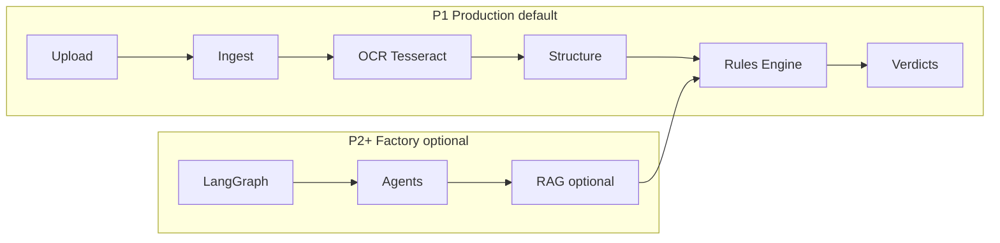

# LabelForge — TTB Alcohol Label Verification

[CI](https://github.com/monigarr/instructions/actions/workflows/ci.yml)

**AI-powered alcohol label verification** for the TTB Compliance Division.

> **Take-home submission:** runnable application code lives in [`app/`](app/). **[ClientRequirement.md](ClientRequirement.md)** is the normative source of truth; all other docs derive from it. **Engineers:** [ONBOARDING.md](ONBOARDING.md) · **Demo:** [REVIEWER_GUIDE.md](REVIEWER_GUIDE.md) · **Proof:** [DELIVERABLES_PROOF.md](DELIVERABLES_PROOF.md)

**Repository:** [github.com/monigarr/instructions](https://github.com/monigarr/instructions)  
**Live demo:** [https://labelforge-w32d.onrender.com](https://labelforge-w32d.onrender.com) · **API docs:** [/docs](https://labelforge-w32d.onrender.com/docs)

**Data & compliance posture:** synthetic fixtures only, standalone prototype, no COLA integration (Marcus Williams, [ClientRequirement.md](ClientRequirement.md)).

---

## Architecture at a glance

Production (default) runs the **P1 linear pipeline**; interview depth toggles the **LangGraph factory** without changing verdict logic.



**Principle:** orchestration is pluggable; **deterministic rules own compliance verdicts**.

---

## Canonical terminology

Use these counts consistently across docs (verified against repo on **2026-07-08**):

| Term | Count | Source |
|------|-------|--------|
| **Golden eval set** | **30** | [`app/evals/datasets/golden_labels.jsonl`](app/evals/datasets/golden_labels.jsonl) — CI regression gate |
| **Full synthetic catalog** | **34** | [`fixture_catalog()`](app/scripts/generate_fixtures.py), [`batch_manifest.json`](app/fixtures/applications/batch_manifest.json) |
| **Scale test fixtures** | **300** | `scale_001`…`scale_300` — [`generate_scale_fixtures.py`](app/scripts/generate_scale_fixtures.py), [`batch_manifest_200.json`](app/fixtures/applications/batch_manifest_200.json) / [`_300`](app/fixtures/applications/batch_manifest_300.json) |
| **Curated gallery samples** | **10** | [`SAMPLE_CATALOG`](app/src/api/samples_catalog.py) — one-click demo cards |
| **Non-golden stretch fixtures** | **4** | `warning_not_bold`, `label_slight_rotation`, `label_low_contrast`, `label_glare_band` — in catalog/gallery, excluded from golden CI (OCR/visual variance) |
| **Pytest unit tests** | **28** | `pytest tests/ --collect-only` across 6 modules |
| **Extra label PNGs** | varies | Label picker only (e.g. `DonPapa.png`); not in catalog or scale manifests |

---

## Who is reviewing?

### Human Code Reviewers ([ClientRequirement.md](ClientRequirement.md))

[ClientRequirement.md](ClientRequirement.md) defines exactly **two submissions**. Start with **[REVIEWER_GUIDE.md](REVIEWER_GUIDE.md)** — no graph/RAG/eval depth required.

| Step | What to do | What it proves |
|------|------------|----------------|
| **1. Try the product** | [labelforge-w32d.onrender.com](https://labelforge-w32d.onrender.com) → **Try this sample** on **Old Tom — Pass** → **Verify Label** | Deployed URL works; P1 path is live |
| **2. Spot-check batch** | Batch tab → **Run demo batch** / **200-label** / **300-label** scale quick-starts | Peak-load batch flow (Sarah/Janet) |
| **3. Skim fixture catalog** | **34** synthetic fixtures in [`app/fixtures/`](app/fixtures/) — **30** golden CI cases — see [DELIVERABLES_PROOF.md](DELIVERABLES_PROOF.md) §2.2 | TTB fields, warning exactness, brand nuance, imports |
| **4. Read proof index** | [DELIVERABLES_PROOF.md](DELIVERABLES_PROOF.md) | Every client requirement → file path + smoke test |

**Submission = live URL + P1 pipeline + synthetic fixture catalog.** Production runs `USE_FACTORY_GRAPH=false`, `RAG_ENABLED=false`, `BATCH_PERSIST=true`, `LATENCY_GATE_ENABLED=true` (fast, auditable, persistent batches).

| # | Client deliverable | Proof |
|---|-------------------|-------|
| 1 | Source code repository | [`app/`](app/) + [`app/README.md`](app/README.md) |
| 2 | Deployed application URL | [https://labelforge-w32d.onrender.com](https://labelforge-w32d.onrender.com) |

### Stakeholder traceability

| Stakeholder | Requirement | Proof |
|-------------|-------------|-------|
| **Sarah Chen** | ≤ ~5 s per label; batch 200–300 | `elapsed_ms` in API/UI; Batch tab + scale manifests |
| **Jenny Park** | Government warning exactness | `warning_title_case`, `warning_wording_change` fixtures |
| **Dave Morrison** | Brand nuance; simple workflow | `stones_throw_brand` → `needs_review`; two-tab UI |
| **Marcus Williams** | Standalone, offline OCR, no COLA | Tesseract default; synthetic fixtures; no COLA integration |

### Human Tech Interviewers (engineering depth)

After the client path above, explore **optional P2+ layers** — same verdict outcomes, richer orchestration:

| Layer | Entry point | Env flags |
|-------|-------------|-----------|
| **Eval harness** (30 golden + adversarial + RAG queries) | [`app/evals/runners/run_eval_suite.py`](app/evals/runners/run_eval_suite.py) | CI blocks regression |
| **Agent factory + LangGraph** | [`app/src/factory/labelforge_factory.py`](app/src/factory/labelforge_factory.py), [`app/src/graph/verification_graph.py`](app/src/graph/verification_graph.py) | `USE_FACTORY_GRAPH=true` |
| **RAG grounding** | [`app/src/rag/corpus/`](app/src/rag/corpus/), [`app/src/agents/compliance_rag_agent.py`](app/src/agents/compliance_rag_agent.py) | `RAG_ENABLED=true` |
| **Architecture narrative** | [ARCHITECTURE.md](ARCHITECTURE.md) §1–6 | — |

Batch verify routes through the factory graph when `USE_FACTORY_GRAPH=true` (single + batch parity).

---

## AI-native engineering (why this is not “just an OCR wrapper”)

| Signal | Implementation | Reviewer entry point |
|--------|----------------|----------------------|
| **Deterministic compliance core** | Rules own verdict bits; agents assist extraction, not legal outcomes | [`app/src/rules/field_rules.py`](app/src/rules/field_rules.py) |
| **Agent software factory** | LangGraph orchestration, specialized agents, factory DI | [`app/src/factory/`](app/src/factory/), [`app/src/graph/`](app/src/graph/) |
| **Eval discipline** | 30 golden + adversarial + RAG suites; CI fails on regression | [`app/evals/`](app/evals/) |
| **RAG grounding** | TTB field corpus (markdown); optional Chroma | [`app/src/rag/corpus/`](app/src/rag/corpus/) |
| **Ports & adapters** | Swappable OCR (Tesseract / Azure / sidecar fallback) | [`app/src/adapters/ocr/`](app/src/adapters/ocr/) |
| **Production path** | Docker, Render Blueprint, GitHub Actions CI | [`render.yaml`](render.yaml), [`.github/workflows/ci.yml`](.github/workflows/ci.yml) |

---

## Current state (last verified against repo: 2026-07-08)

| Layer | Status |
|-------|--------|
| **Application** | FastAPI v0.1.0 + React (USWDS 3.0–aligned UI), single + batch verify, **34** catalog + **300** scale fixtures, **30** golden evals, **10** gallery samples |
| **Production** | Live on Render — [labelforge-w32d.onrender.com](https://labelforge-w32d.onrender.com) (`USE_FACTORY_GRAPH=false`, `RAG_ENABLED=false`, `BATCH_PERSIST=true`, `LATENCY_GATE_ENABLED=true`) |
| **CI** | **28** pytest tests + fixture/scale/eval generation + latency benchmark (non-blocking) + eval suite (regression gate) + UI build |
| **Documentation** | [REVIEWER_GUIDE.md](REVIEWER_GUIDE.md), proof index, PRD, architecture, [app/DEPLOY.md](app/DEPLOY.md) |

---

## Design & UI

We referred to the official [U.S. Web Design System (USWDS 3.0)](https://designsystem.digital.gov/) to create our UI/UX — Public Sans typography, federal design tokens, and component patterns in custom CSS ([`app/ui/src/styles.css`](app/ui/src/styles.css)).

---

## Documentation map

| Document | Audience | Purpose |
|----------|----------|---------|
| **[ONBOARDING.md](ONBOARDING.md)** | **Engineers & architects** | Enterprise onboarding — repo map, runbook, config matrix, quality gates |
| **[REVIEWER_GUIDE.md](REVIEWER_GUIDE.md)** | **Everyone first** | 3-minute demo + stakeholder map |
| **[DELIVERABLES_PROOF.md](DELIVERABLES_PROOF.md)** | **Client reviewers** | Proof index — URLs, paths, smoke tests |
| [ClientRequirement.md](ClientRequirement.md) | Normative | Authoritative client requirements (do not edit for proof) |
| [DELIVERABLES.md](DELIVERABLES.md) | Submission | Client checklist |
| [PRD.md](PRD.md) | Product | Requirements + phased delivery |
| [ARCHITECTURE.md](ARCHITECTURE.md) | Interview | LabelForge agent factory (P2+ in code) |
| [app/README.md](app/README.md) | Developers | Run locally, approach, trade-offs |
| [app/DEPLOY.md](app/DEPLOY.md) | Operations | Docker, Render, Railway, env vars |

---

## Quick start (local)

```bash
cd app
python -m venv .venv && .venv\Scripts\activate   # Windows
pip install -e ".[dev]"
cp .env.example .env
python scripts/generate_fixtures.py
python scripts/generate_scale_fixtures.py
python scripts/generate_eval_datasets.py
uvicorn src.api.main:app --reload --port 8000
```

UI: `cd app/ui && npm install && npm run dev` → [http://localhost:5173](http://localhost:5173)  
Docker: `cd app && docker compose up --build` → [http://localhost:8000](http://localhost:8000)

For Vite dev on `:5173`, set `VITE_API_URL=http://localhost:8000` in `app/ui/.env.local` so the sample gallery and label picker reach the API (see [app/README.md](app/README.md)).

---

## Author

Monica Peters (MoniGarr) — Gauntlet AI GFA Cohort 5 Fellowship, 2026
